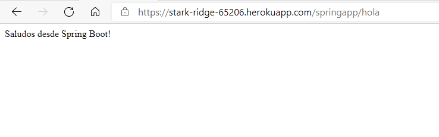
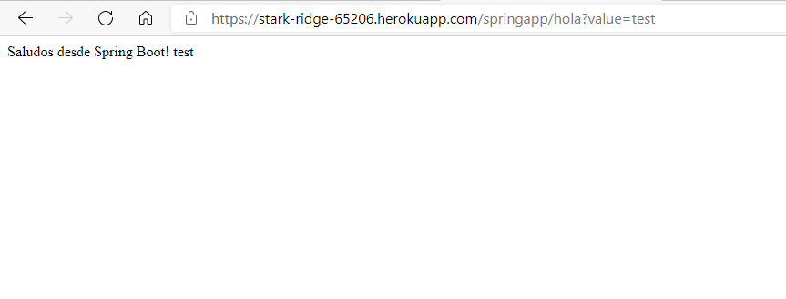
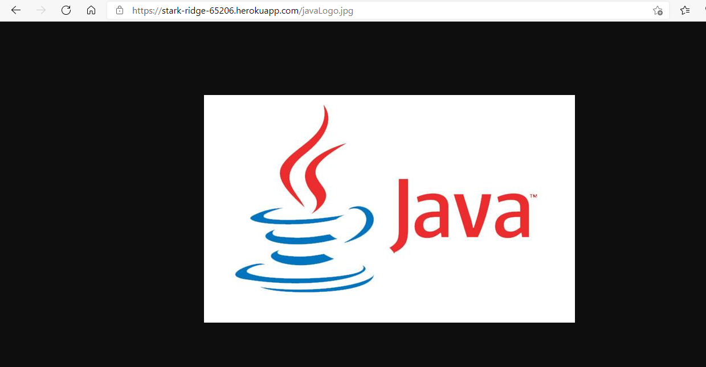
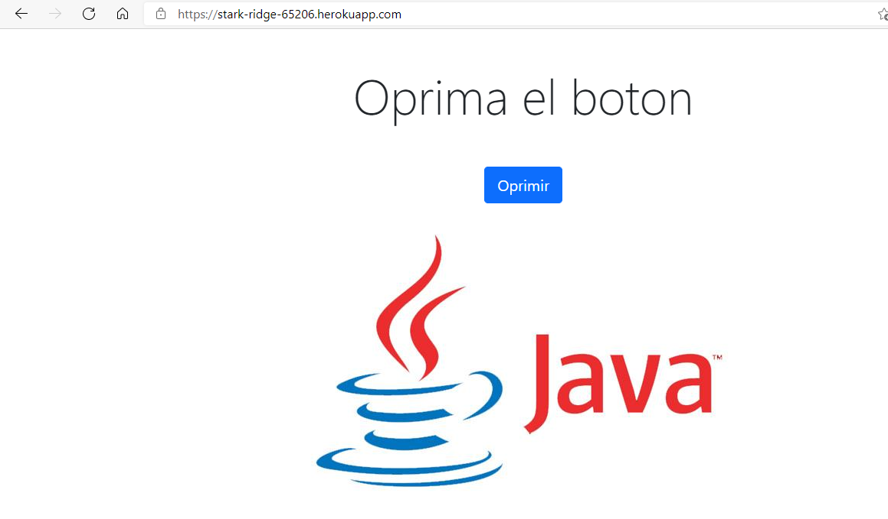
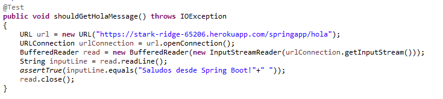
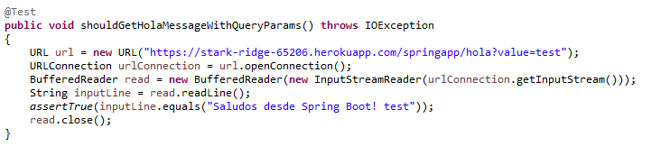
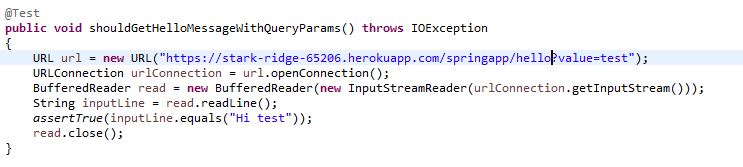
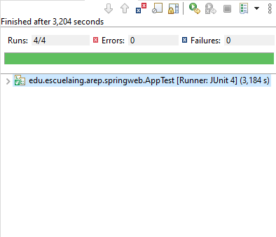

# Taller arquitecturas de servidores de aplicaciones, meta protocolos de objetos, patrón ioc, reflexión                           
**Haciendo uso Java, Maven, Git y Heroku se desarrollaro el siguiente ejercicio:**             

Construir un servidor Web (tipo Apache) en Java. El servidor debe ser capaz de entregar páginas html e imágenes tipo PNG. Igualmente el servidor debe proveer un framework IoC para la construcción de aplicaciones web a partir de POJOS. Usando el servidor se debe construir una aplicación Web de ejemplo y desplegarlo en Heroku. El servidor debe atender múltiples solicitudes no concurrentes.

Para este taller desarrolle un prototipo mínimo que demuestre capcidades reflexivas de JAVA y permita por lo menos cargar un bean (POJO) y derivar una aplicación Web a partir de él. Debe entregar su trabajo al final del laboratorio.
### Pre-requisitos
Para hacer uso del software es necesario tener instalado:
* Maven: Automatiza y estandariza el flujo de vida de la construcción de software.                 
    Siga las instrucciones en http://maven.apache.org/download.cgi#Installation
* Git: Administrador descentralizado de configuraciones.                     
    Siga las instrucciones en http://git-scm.com/book/en/v2/Getting-Started-Installing-Git
* Toolbelt de Heroku: Paquete de la CLI de Heroku                            
    Siga las instrucciones en https://devcenter.heroku.com/articles/heroku-cli
## Comenzando
Para obtener una copia del proyecto en nuestra máquina local y podamos realizar tareas de desarrollo, pruebas o ejecuciones debemos clonarlo utilizando el siguiente comando:
```
git clone https://github.com/germanAOQ/AREP-4-NanoSpringWeb.git
```
### Instalación
Una vez clonado el proyecto, carpeta donde hayamos hecho el ejercicio, abrimos la shell del sistema operativo en la que estemos y accedemos al directorio de este
```
cd AREP-4-NanoSpringWeb
```
Ejecutamos la fase **package**, la cual ejecutara las fases previas del ciclo de vida: **validate, compile y test** y empaquetará el código ya compilado en un formato que se le haya especificado en el archivo de configuración, POM.xml
```
mvn package
```
### Ejecución
Para ejecutar localmente el proyecto se debe usar el siguiente comando, cabe resaltar que este comando se ejecuta en un sistema operativo Windows y haciendo uso de PowerShell
```
java -cp target/classes edu.escuelaing.arep.nanospring.NanoSpringBoot edu.escuelaing.arep.nanospringdemo.NanoSpringDemo
```
Una vez hecha la ejecución, se podrá acceder a la aplicación localmente através de la siguiente dirección:
```
http://localhost:36000/
```
Además, se podrá visualizar unicamente la imagen (javaLogo.jpg) accediendo a:
```
http://localhost:36000/javaLogo.jpg
```
## Pruebas
Se presentan dos tipos pruebas: pruebas sobre el funcionamiento general de la aplicación y pruebas unitarias:
### Pruebas de funcionamiento general
Para estas pruebas se intenta lanzar un mensaje a partir de la configuración de una anotación, añadirle un query param, abrir una imagen desde el servidor y ejecutar un index.html. Por defecto, a las aplicaciones Spring se accede con el path /, es por esto que el archivo index se ejecuta sin necesidad de especificarlo en la ruta. Esto se logra apreciar en los siguientes pantallazos:                                                          






                                                      
### Pruebas unitarias
Se hacen un total de 4 pruebas unitarias que validan la correctitud de cuatro mensajes definidos previamente en la clase NanoSpringDemo(Bean):









## Documentación

### Generar documentación
Para generar la documentación se debe agregar al código del archivo de configuración de Maven, POM.xml, el siguiente plugin:
```
<plugin>
	<groupId>org.apache.maven.plugins</groupId>
	<artifactId>maven-javadoc-plugin</artifactId>
	<executions>
		<execution>
			<id>attach-javadocs</id>
			<goals>
				<goal>jar</goal>
			</goals>
		</execution>
	</executions>
</plugin>

```
Uno vez agregado el plugin anterior, se ejecuta el siguiente comando para generar el javadoc
```
mvn install
```
Finalmente, en la carpeta target quedará creado un archivo con el nombre **apidocs**, lugar en donde se encontrará la documentación.

## Construido con 
* [Maven](https://maven.apache.org/) - Manejador de dependencias
* [Git](https://github.com/) - Control de versionamiento
* [Heroku](https://heroku.com) - Plataforma de despliegue [](https://stark-ridge-65206.herokuapp.com/)
* [Circle CI]() - Integración Continua 

## Autores 
* [Germán Andrés Ospina Quintero](https://github.com/germanAOQ)

## Licencia 📄
Este proyecto esta licenciado por GNU General Public License v3.0
